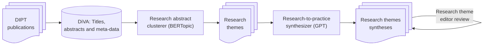

# About

This is SciPop, the friendly AI that analyses and synthesizes scientific articles for the general public.

# Environment setup

1. Install uv

   Follow the installation instructions at [https://docs.astral.sh/uv/getting-started/installation/](https://docs.astral.sh/uv/getting-started/installation/)

2. Create a virtual environment

   `uv venv --python 3.12`

3. Activate the virtual environment

   **Linux/Mac:** `source .venv/bin/activate`
   
   **Windows:** `.venv\Scripts\activate`

4. Install required packages

   `uv pip install -r requirements.txt`

**Note:** The original conda-based setup is preserved in the git history if needed.
