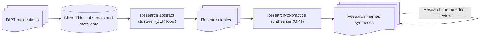

# About

This is SciPop, the friendly AI that analyses and synthesizes scientific articles for the general public.

# Environment setup

1. Install miniconda
2. Switch to the base environment

   `conda activate base`
3. Create a new conda environment and switch to it

   `conda create --name scipop python=3.12 pip`

    `conda activate scipop`
4. Install required packages

   `pip install -r requirements.txt`
