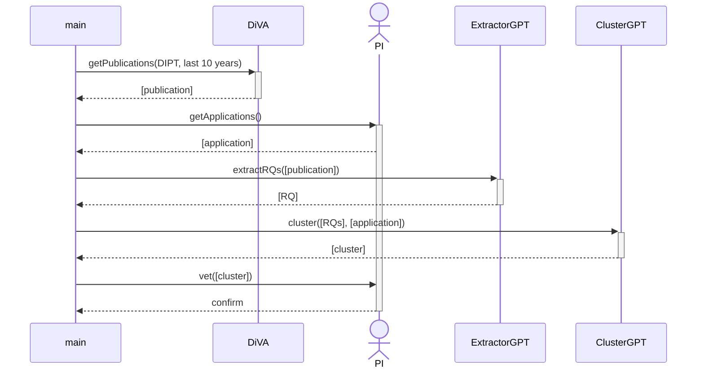
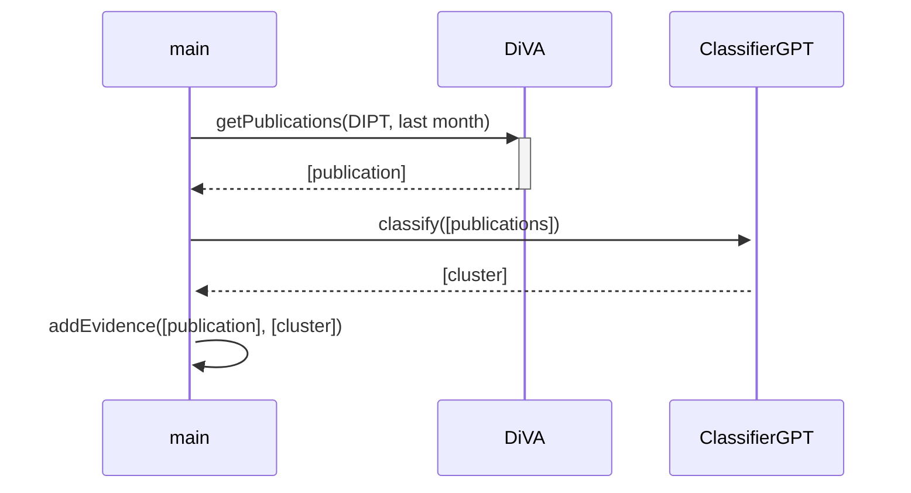

# Loops

The following two sequence diagrams visualize the two loops that populate the competence map with content.
The competence map is goverened by two loops.

## Loop 1: Topic Clustering

The first sequence diagram describes the big loop (executed twice a year) that generates our current research clusters from publications and applications.

## Loop 2: Gathering Evidence

The second sequence diagram describes the small loop (executed once per month) that populates these clusters with recent evidence. 

